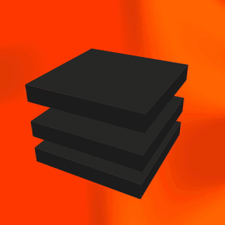
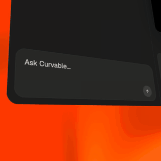
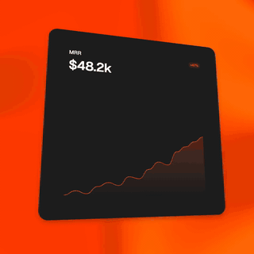
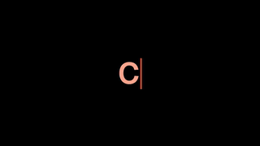
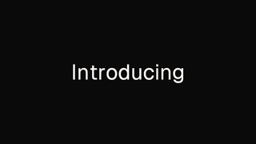
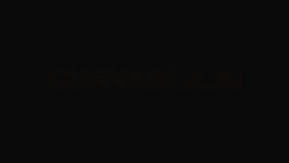
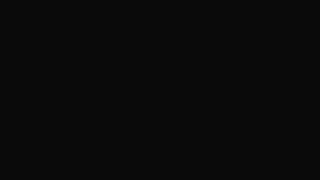
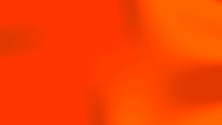

# @curvable/motion

Premium open source motion components for [Remotion](https://www.remotion.dev). Fourteen scenes that power the launch video templates at [curvable.ai](https://curvable.ai), drop in ready, MIT licensed.

<table>
  <tr>
    <td align="center" width="33%"><br><b>Floating stack</b></td>
    <td align="center" width="33%"><br><b>Prompt input</b></td>
    <td align="center" width="33%"><br><b>Stats grid</b></td>
  </tr>
</table>

Live previews and prop knobs: [curvable.ai/library](https://curvable.ai/library)

## Why

Every Remotion component in this library follows the same contract:

- Deterministic on frame. Render the same input at the same frame and you get the same pixels, every time. Works in `<Player>` for browser preview and in `renderMedia` for headless MP4 output without any conditional code paths.
- One brand color knob. Pass a single `primary` hex and every shade the component needs is derived for you in HSL space. Hue stays locked, lightness and saturation shift, so a non orange primary still produces a coherent palette.
- Frozen defaults. Each component exports a `Defaults` object you can spread into `inputProps`, plus a `Meta` object with width, height and fps, plus a `compute<Name>Duration` helper for the variable length scenes.

No agent in your pipeline has to invent timing or colors. Pass a string in, get pixels out.

## Install

```bash
npm install @curvable/motion remotion react
```

Two optional peer dependencies extend the surface:

- `ogl` is the WebGL micro-runtime that drives the `GrainientBg` shader. Install it if you plan to use `GrainientBg`, `FloatingStack`, `PromptInput` or `StatsGrid` (all four use a Grainient backdrop).
- `@remotion/google-fonts` ships the Geist + Geist Mono webfonts used by the `PromptInput` scene's mini dashboard text.

```bash
npm install ogl @remotion/google-fonts
```

The `PromptInput` scene also renders an Apple Intelligence style glow behind the preview pane via [CanvasKit](https://skia.org/docs/user/modules/canvaskit/). For that to work at runtime, host `canvaskit.js` and `canvaskit.wasm` at the root of your site (the source loads them from `/canvaskit.js` and `/canvaskit.wasm`). Copy them from [canvaskit-wasm](https://www.npmjs.com/package/canvaskit-wasm) into your public folder, or comment out the glow if you don't need it.

## Quick start

```tsx
import { Player } from '@remotion/player';
import { Typewriter, TypewriterDefaults, TypewriterMeta, computeTypewriterDuration } from '@curvable/motion';

export function Preview() {
  return (
    <Player
      component={Typewriter}
      inputProps={{ ...TypewriterDefaults, text: 'Ship faster.', primary: '#6633CC' }}
      durationInFrames={computeTypewriterDuration({
        text: 'Ship faster.',
        framesPerChar: TypewriterDefaults.framesPerChar,
        fadeFrames: TypewriterDefaults.fadeFrames,
        startDelayFrames: TypewriterDefaults.startDelayFrames,
        holdFrames: TypewriterDefaults.holdFrames,
      })}
      fps={TypewriterMeta.fps}
      compositionWidth={TypewriterMeta.width}
      compositionHeight={TypewriterMeta.height}
      autoPlay
      loop
      controls={false}
    />
  );
}
```

For headless renders, the same component slots into `renderMedia`:

```tsx
import { renderMedia } from '@remotion/renderer';
import { TypewriterMeta, computeTypewriterDuration, TypewriterDefaults } from '@curvable/motion';

await renderMedia({
  composition: {
    id: 'typewriter',
    width: TypewriterMeta.width,
    height: TypewriterMeta.height,
    fps: TypewriterMeta.fps,
    durationInFrames: computeTypewriterDuration({ ...TypewriterDefaults }),
    defaultProps: { ...TypewriterDefaults, text: 'Ship faster.' },
  },
  serveUrl: bundled,
  codec: 'h264',
  outputLocation: 'out.mp4',
});
```

## Components

Fourteen scenes across three categories.

### Text

<table>
  <tr>
    <td width="280"></td>
    <td><b>Typewriter</b><br>Each character is born in the accent color and fades to the resting color, with a caret that stays flush against the latest glyph. Bar or block caret. Smooth or hard fade.</td>
  </tr>
  <tr>
    <td width="280"></td>
    <td><b>Slide reveal</b><br>Sentence slides off screen left while each word lifts in from below. Words appear in the accent color and ease to the text color.</td>
  </tr>
  <tr>
    <td width="280"></td>
    <td><b>Cascading text</b><br>Words enter from the right with a slow fast slow ease, drift left continuously, and the camera zooms out in distinct beats so longer sentences stay readable.</td>
  </tr>
  <tr>
    <td width="280"></td>
    <td><b>Text swap</b><br>Two word swap. Letters from word 1 flash in the brand primary then disappear in random pairs while word 2 settles in their place. Letters never collide.</td>
  </tr>
  <tr>
    <td width="280"></td>
    <td><b>TextHover (Light sweep)</b><br>Feathered light bar sweeps across bold outline text, revealing a gradient fill as it passes. Always rainbow or sweep to mono, with 2 to 5 color stops.</td>
  </tr>
  <tr>
    <td width="280"></td>
    <td><b>PastePill</b><br>Word spring sentence reveal with a shining gradient pill on the matched word. A 3D cursor flies up from below, dips on click, and the pill swaps to a grey active label.</td>
  </tr>
  <tr>
    <td width="280"></td>
    <td><b>CurvableTypes (Zoom typed reveal)</b><br>The first word zooms in from huge and blurred, settles at canvas center, and slides right while trailing words slide in. Per letter cascade or per word reveal.</td>
  </tr>
</table>

### Background

<table>
  <tr>
    <td width="280"></td>
    <td><b>BulbBg</b><br>Rising dome with a soft blurred halo over a warm dark canvas. Loops continuously or sinks down / grows up as an exit beat.</td>
  </tr>
  <tr>
    <td width="280"></td>
    <td><b>TwoDropsBg</b><br>Two teardrops glide on opposite sides of a rounded perimeter, glow spilling into the corners. Five derived shades from one primary color.</td>
  </tr>
  <tr>
    <td width="280"></td>
    <td><b>EllipseBloom</b><br>A two layer ellipse blooms from a pinhead to fill the frame in well under a second. Inner highlight is the primary, outer ring is a derived darker shade.</td>
  </tr>
  <tr>
    <td width="280"></td>
    <td><b>GrainientBg</b><br>A warped three color gradient that drifts continuously, painterly background that warps without animating any focal element. Requires the optional <code>ogl</code> peer dependency.</td>
  </tr>
</table>

### Component (composite scenes)

Larger scenes that combine a backdrop, a foreground composition, and timing into one launch tile sized render. All three derive every accent shade (cursor, slab glows, card highlights, bulb halo) from one `primary` knob.

<table>
  <tr>
    <td width="280"></td>
    <td><b>FloatingStack</b><br>Three 3D slabs floating in an accordion wave, drifting at their own beat, with a cursor that pauses on each slab. Backdrop Grainient plus three slab glow shades all derived from one brand color.</td>
  </tr>
  <tr>
    <td width="280"></td>
    <td><b>PromptInput</b><br>A 3D tilted dashboard sits over a coloured bulb halo and a drifting Grainient. A cursor flies in from below, types into the composer, clicks Send, and flies out. Backdrop, bulb halo, cursor and dashboard accents all derive from one brand color.</td>
  </tr>
  <tr>
    <td width="280"></td>
    <td><b>StatsGrid</b><br>A hero metric morphs into a 2x2 of frosted cards on a tilted plane, each chart and counter bobbing on its own beat. Backdrop and card highlights all derive from one brand color.</td>
  </tr>
</table>

## API conventions

Each component exports five things. Using `Typewriter` as the canonical example:

```ts
import {
  Typewriter,                  // React.FC<TypewriterProps>
  type TypewriterProps,        // Public props type
  TypewriterDefaults,          // Frozen default values
  TypewriterMeta,              // { width, height, fps, durationFrames? }
  computeTypewriterDuration,   // (params) => number of frames
} from '@curvable/motion';
```

For components with a single fixed loop length, `Meta.durationFrames` is the number you want. For variable length scenes (typewriter, cascading text, etc.), call `compute<Name>Duration(params)` with the same params you pass as inputProps and it returns the total frame count, including all reveal and hold phases.

`<Name>Defaults` ships pre-tuned values for every prop. Spread them and override only what you need:

```tsx
<Player
  component={CascadingText}
  inputProps={{
    ...CascadingTextDefaults,
    text: 'Your custom text goes here.',
    primary: '#6633CC',
  }}
  durationInFrames={computeCascadingTextDuration({
    text: 'Your custom text goes here.',
    fadeDuration: CascadingTextDefaults.fadeDuration,
  })}
  fps={CascadingTextMeta.fps}
  compositionWidth={CascadingTextMeta.width}
  compositionHeight={CascadingTextMeta.height}
  autoPlay
  loop
  controls={false}
/>
```

## Colors

Most components accept a single `primary` hex and derive every dependent shade in HSL space. This is the same recipe the Grainient component uses, exposed as `deriveGrainientPalette(primary)` so you can match accents across scenes that do not share a registry:

```ts
import { deriveGrainientPalette } from '@curvable/motion';

const { color1, color2, color3 } = deriveGrainientPalette('#6633CC');
```

Components that need light versus dark backgrounds also accept a `lightMode: boolean` prop. The frozen palettes in `palettes.ts` adjust shade lightness and contrast for both surfaces.

## Live previews

Spin up the registry locally to tweak knobs in your browser:

[curvable.ai/library](https://curvable.ai/library)

Each preset card hovers to play and clicks through to a tweak page with every knob exposed, plus the source TSX.

## License

MIT. Copyright (c) 2026 Curvable.

You can use, fork and ship these in commercial products, branded videos, agency work, anything. Attribution welcome but not required.

## Built by

[Curvable](https://curvable.ai), an AI launch video generator for SaaS founders. From URL to MP4 in minutes.
